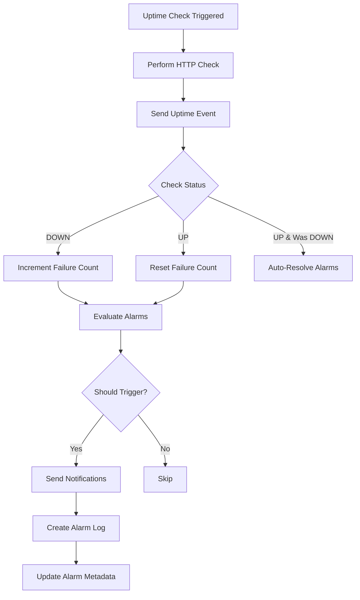

# Uptime Monitoring Alarm Integration

This document describes the integration between the Uptime Monitoring system and the Alarms System, addressing issue #268.

## Overview

The Uptime Alarm Integration automatically triggers notifications when websites go down, come back up, or experience performance degradation. It provides smart alerting with consecutive failure tracking to prevent notification spam.

## Implementation Status

### ✅ Completed

1. **Alarm Trigger Service** (`apps/uptime/src/lib/alarm-trigger.ts`)
   - Evaluate alarms based on uptime check results
   - Track consecutive failures for smart alerting
   - Trigger notifications when conditions are met
   - Create alarm logs for audit trail
   - Auto-resolve alarms when website recovers

2. **Uptime Integration** (`apps/uptime/src/index.ts`)
   - Integrated alarm evaluation into uptime check workflow
   - Non-blocking alarm processing (doesn't break uptime checks)
   - Consecutive failure tracking
   - Auto-resolution on recovery
   - Previous status tracking

## How It Works

### Workflow



### Alarm Evaluation Logic

1. **Find Active Alarms**: Query all enabled alarms for the uptime schedule
2. **Check Conditions**: Evaluate each alarm's trigger conditions
3. **Consecutive Failures**: Only trigger after N consecutive failures (configurable)
4. **Send Notifications**: Trigger all configured notification channels
5. **Create Log**: Record the alarm trigger in alarm_logs table
6. **Update Metadata**: Update lastTriggeredAt and triggerCount

### Smart Alerting

- **Consecutive Failures**: Prevent false positives by requiring multiple failures
- **Single Trigger**: Only trigger once when threshold is reached, not on every failure
- **Auto-Resolution**: Automatically resolve alarms when website recovers
- **Non-Blocking**: Alarm evaluation doesn't break uptime checks

## Alarm Conditions

### Uptime Alarm Conditions Schema

```typescript
{
  uptimeScheduleId: string;           // Required: Link to uptime schedule
  triggerOn: ("down" | "up" | "degraded")[]; // What events to trigger on
  consecutiveFailures: number;        // How many failures before triggering
  responseTimeThreshold: number;      // Threshold in ms for degraded status
  statusCodes: number[];              // Specific HTTP codes to trigger on
}
```

### Example Conditions

#### Basic Down Alert
```json
{
  "uptimeScheduleId": "schedule_123",
  "triggerOn": ["down"],
  "consecutiveFailures": 3
}
```
**Behavior**: Triggers after 3 consecutive failures

#### Down + Recovery Alert
```json
{
  "uptimeScheduleId": "schedule_123",
  "triggerOn": ["down", "up"],
  "consecutiveFailures": 2
}
```
**Behavior**: Triggers when down (after 2 failures) and when recovered

#### Performance Degradation Alert
```json
{
  "uptimeScheduleId": "schedule_123",
  "triggerOn": ["degraded"],
  "responseTimeThreshold": 5000
}
```
**Behavior**: Triggers when response time exceeds 5 seconds

#### Specific Status Code Alert
```json
{
  "uptimeScheduleId": "schedule_123",
  "triggerOn": ["down"],
  "statusCodes": [500, 502, 503],
  "consecutiveFailures": 1
}
```
**Behavior**: Triggers immediately on 5xx errors

## API Usage

### Create Uptime Alarm

```bash
POST /alarms
Content-Type: application/json

{
  "name": "Production Website Down Alert",
  "description": "Alert when production website goes down",
  "type": "uptime",
  "enabled": true,
  "notificationChannels": ["slack", "email"],
  "slackWebhookUrl": "https://hooks.slack.com/services/...",
  "emailAddresses": ["ops@example.com", "admin@example.com"],
  "conditions": {
    "uptimeScheduleId": "schedule_abc123",
    "triggerOn": ["down", "up"],
    "consecutiveFailures": 3
  },
  "uptimeScheduleId": "schedule_abc123"
}
```

### Response

```json
{
  "success": true,
  "data": {
    "id": "alarm_xyz789",
    "name": "Production Website Down Alert",
    "type": "uptime",
    "enabled": true,
    "notificationChannels": ["slack", "email"],
    "conditions": {
      "uptimeScheduleId": "schedule_abc123",
      "triggerOn": ["down", "up"],
      "consecutiveFailures": 3
    },
    "lastTriggeredAt": null,
    "triggerCount": "0",
    "createdAt": "2024-01-15T10:00:00Z"
  }
}
```

## Notification Examples

### Slack Notification (Website Down)

```json
{
  "text": "🚨 Production Website Down Alert",
  "blocks": [
    {
      "type": "header",
      "text": {
        "type": "plain_text",
        "text": "🚨 Production Website Down Alert"
      }
    },
    {
      "type": "section",
      "fields": [
        {
          "type": "mrkdwn",
          "text": "*Alarm:*\nProduction Website Down Alert"
        },
        {
          "type": "mrkdwn",
          "text": "*Type:*\nuptime"
        },
        {
          "type": "mrkdwn",
          "text": "*Time:*\n2024-01-15T10:30:00Z"
        },
        {
          "type": "mrkdwn",
          "text": "*Reason:*\nWebsite returned HTTP 500"
        }
      ]
    },
    {
      "type": "section",
      "text": {
        "type": "mrkdwn",
        "text": "*Details:*\n```{\n  \"status\": \"DOWN\",\n  \"httpCode\": 500,\n  \"responseTime\": 5234,\n  \"region\": \"us-east-1\"\n}```"
      }
    }
  ]
}
```

### Email Notification (Website Recovered)

**Subject**: ✅ Production Website Down Alert - Recovered

**Body**:
```html
<!DOCTYPE html>
<html>
<head>
  <style>
    body { font-family: Arial, sans-serif; }
    .alert { background: #d4edda; border-left: 4px solid #28a745; padding: 20px; }
    .details { margin-top: 20px; }
    .details table { width: 100%; }
    .details td { padding: 8px; border-bottom: 1px solid #eee; }
  </style>
</head>
<body>
  <div class="alert">
    <h2>✅ Website Recovered</h2>
    <p>Your website <strong>example.com</strong> is back up and running.</p>
  </div>
  
  <div class="details">
    <table>
      <tr>
        <td><strong>Alarm:</strong></td>
        <td>Production Website Down Alert</td>
      </tr>
      <tr>
        <td><strong>Status:</strong></td>
        <td>UP</td>
      </tr>
      <tr>
        <td><strong>Recovery Time:</strong></td>
        <td>2024-01-15 10:35 UTC</td>
      </tr>
      <tr>
        <td><strong>Downtime Duration:</strong></td>
        <td>5 minutes</td>
      </tr>
      <tr>
        <td><strong>Response Time:</strong></td>
        <td>234ms</td>
      </tr>
    </table>
  </div>
</body>
</html>
```

## Alarm Logs

Every alarm trigger creates a log entry:

```typescript
{
  id: "log_123",
  alarmId: "alarm_xyz789",
  triggeredAt: "2024-01-15T10:30:00Z",
  triggerReason: "Website returned HTTP 500",
  triggerData: {
    status: "DOWN",
    httpCode: 500,
    responseTime: 5234,
    errorMessage: "Internal Server Error",
    region: "us-east-1",
    timestamp: "2024-01-15T10:30:00Z"
  },
  notificationsSent: ["slack", "email"],
  notificationErrors: null,
  resolvedAt: "2024-01-15T10:35:00Z",
  autoResolved: true
}
```

## Consecutive Failure Tracking

The system tracks consecutive failures in-memory:

```typescript
// First failure
consecutiveFailures.increment("schedule_123") // Returns 1

// Second failure
consecutiveFailures.increment("schedule_123") // Returns 2

// Third failure - triggers alarm if threshold is 3
consecutiveFailures.increment("schedule_123") // Returns 3

// Website recovers
consecutiveFailures.reset("schedule_123") // Resets to 0
```

**Note**: For production, consider moving this to Redis for persistence across restarts.

## Auto-Resolution

When a website recovers (status changes from DOWN to UP):

1. Find all open alarm logs for the uptime schedule
2. Set `resolvedAt` to current timestamp
3. Set `autoResolved` to true
4. Log the resolution

This provides a complete audit trail of incidents and their resolution.

## Error Handling

- **Non-Blocking**: Alarm evaluation errors don't break uptime checks
- **Graceful Degradation**: If notifications fail, the error is logged but check continues
- **Retry Logic**: Notification service has built-in retry with exponential backoff
- **Error Tracking**: All errors are captured in alarm logs

## Performance Considerations

1. **Async Processing**: Alarm evaluation is non-blocking
2. **Efficient Queries**: Indexed queries on uptimeScheduleId and enabled status
3. **In-Memory Tracking**: Consecutive failures tracked in-memory for speed
4. **Batch Operations**: Multiple alarms evaluated in parallel

## Testing

### Manual Testing

```bash
# 1. Create an uptime schedule
POST /api/uptime/schedules
{
  "url": "https://example.com",
  "interval": "5m"
}

# 2. Create an alarm for the schedule
POST /alarms
{
  "name": "Test Alarm",
  "type": "uptime",
  "notificationChannels": ["slack"],
  "slackWebhookUrl": "https://hooks.slack.com/...",
  "conditions": {
    "uptimeScheduleId": "schedule_123",
    "triggerOn": ["down"],
    "consecutiveFailures": 2
  },
  "uptimeScheduleId": "schedule_123"
}

# 3. Simulate downtime by pointing to a non-existent URL
PATCH /api/uptime/schedules/schedule_123
{
  "url": "https://nonexistent-domain-12345.com"
}

# 4. Wait for 2 consecutive failures (2 x interval)
# 5. Check alarm logs
GET /alarms/alarm_123/logs

# 6. Fix the URL to trigger recovery
PATCH /api/uptime/schedules/schedule_123
{
  "url": "https://example.com"
}

# 7. Verify auto-resolution
GET /alarms/alarm_123/logs
```

### Test Checklist

- [ ] Alarm triggers after consecutive failures
- [ ] Alarm doesn't trigger before threshold
- [ ] Recovery notification sent when website comes back up
- [ ] Alarm logs created correctly
- [ ] Auto-resolution works
- [ ] Multiple notification channels work
- [ ] Consecutive failure counter resets on recovery
- [ ] Performance degradation alerts work
- [ ] Specific status code filtering works
- [ ] Alarm evaluation doesn't break uptime checks

## Configuration

### Environment Variables

No additional environment variables required. Uses existing:
- Database connection (from `@databuddy/db`)
- Notification service configuration (from `@databuddy/notifications`)

### Alarm Settings

All alarm settings are configured via the API:
- `consecutiveFailures`: Number of failures before triggering (default: 1)
- `triggerOn`: Array of events to trigger on (default: ["down"])
- `responseTimeThreshold`: Threshold in ms for degraded status
- `statusCodes`: Specific HTTP codes to trigger on

## Future Enhancements

1. **Redis Integration**: Move consecutive failure tracking to Redis for persistence
2. **Escalation Policies**: Escalate to different channels if not resolved
3. **Quiet Hours**: Don't send notifications during specified hours
4. **Notification Grouping**: Group multiple triggers into single notification
5. **Custom Trigger Logic**: Support complex AND/OR conditions
6. **Incident Correlation**: Correlate multiple alarms for same incident
7. **SLA Tracking**: Track uptime SLA and alert when breached
8. **Predictive Alerts**: ML-based prediction of potential downtime

## Related Issues

- Depends on #267 - Alarms System - Database, API & Dashboard UI
- Closes #268 - Uptime Monitoring Alarm Integration

## Contributors

- Implementation: @1234-ad (via Bhindi AI)
- Original issue: @izadoesdev
